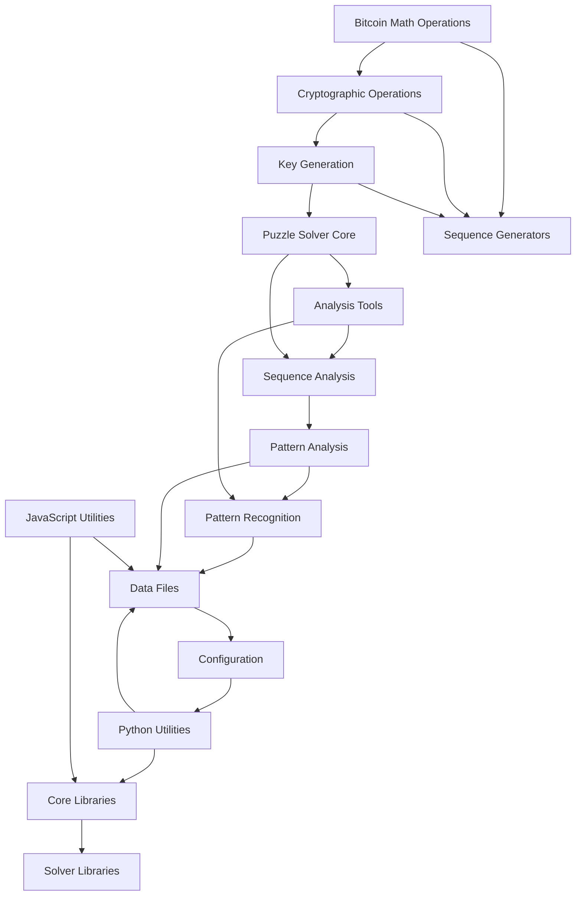

# Component Dependencies

## Dependency Descriptions

### Core Dependencies
1. **Bitcoin Math Operations**
   - Depends on: None (Core Foundation)
   - Used by: Cryptographic Operations, Sequence Generators

2. **Cryptographic Operations**
   - Depends on: Bitcoin Math Operations
   - Used by: Key Generation, Sequence Generators

3. **Key Generation**
   - Depends on: Cryptographic Operations
   - Used by: Puzzle Solver, Sequence Generators

### Analysis Dependencies
4. **Puzzle Solver**
   - Depends on: Key Generation
   - Used by: Analysis Tools, Sequence Analysis

5. **Analysis Tools**
   - Depends on: Puzzle Solver
   - Used by: Pattern Recognition, Sequence Analysis

6. **Pattern Recognition**
   - Depends on: Analysis Tools
   - Used by: Data Files, Pattern Analysis

### Data Flow Dependencies
7. **Sequence Generators**
   - Depends on: Bitcoin Math, Cryptographic Operations, Key Generation
   - Used by: Sequence Analysis, Data Files

8. **Data Files**
   - Depends on: Pattern Recognition, Python Utilities, JavaScript Utilities
   - Used by: Configuration, Core Libraries

### Utility Dependencies
9. **Python Utilities**
   - Depends on: Configuration
   - Used by: Core Libraries, Data Files

10. **JavaScript Utilities**
    - Depends on: Configuration
    - Used by: Core Libraries, Data Files

### Library Dependencies
11. **Core Libraries**
    - Depends on: Python Utilities, JavaScript Utilities
    - Used by: Solver Libraries

12. **Solver Libraries**
    - Depends on: Core Libraries
    - Used by: None (End of Chain)

## Dependency Rules
1. Core components (Bitcoin Math, Crypto Ops) have no external dependencies
2. Analysis components depend on core components
3. Data processing depends on analysis results
4. Utilities depend on configuration
5. Libraries depend on utilities
6. No circular dependencies allowed 