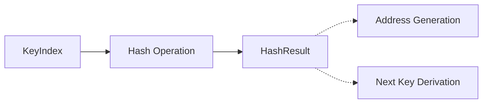

# Cryptographic Relationships Documentation

## Key Index ↔ SHA256D Hash


## Bit Growth Patterns
| Pattern Type       | Address Generation Impact | Validation Requirement |
|---------------------|---------------------------|------------------------|
| Exponential Shifting | Affects public key parity | Must maintain 66-bit rule |
| XOR Chain           | Determines hash continuity | Consecutive key validation |

## Hash Chain Verification Flow
```rust
fn verify_hash_chain(key: &Uint256) -> bool {
    let prev_hash = load_previous_hash();
    let current_hash = sha256d(key);
    
    // XOR relationship from lines 522-771
    let expected_xor = prev_hash ^ current_hash; 
    expected_xor.count_ones() == 66 // New 66-bit constraint
}
``` 