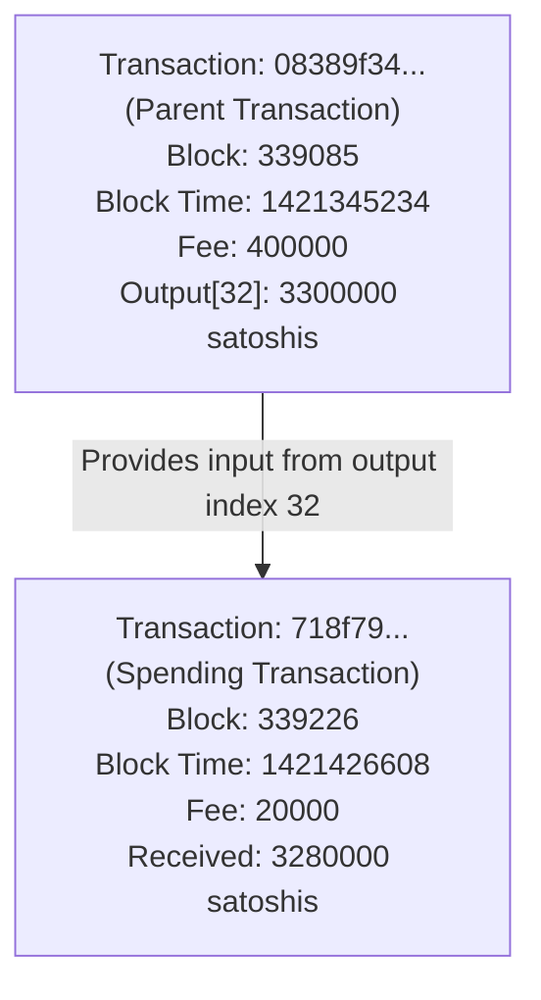

# Transaction Relationship Diagram for 187swFMjz1G54ycVU56B7jZFHFTNVQFDiu.json

Below is a Mermaid diagram visualizing the relationship between the transactions in the JSON file.

*Notes:*
- Transaction "08389f34..." is the parent transaction with multiple outputs. Its output at index 32, amounting to 3300000 satoshis, is used as an input.
- Transaction "718f79..." is the spending transaction that uses that input and receives 3280000 satoshis after paying a fee of 20000 satoshis.
- Data is extracted from tx_cache/187swFMjz1G54ycVU56B7jZFHFTNVQFDiu.json. 