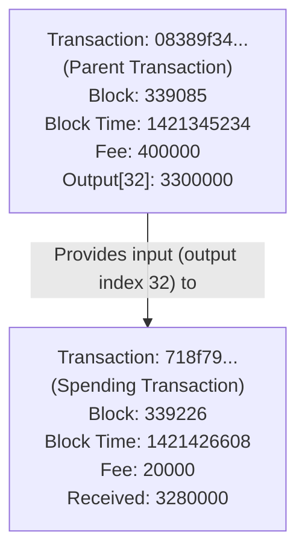

# Transaction Relationship Diagram

Below is a Mermaid diagram visualizing the relationship between the two transactions present in the JSON file.

*Notes:*
- Transaction "08389f34..." is the parent transaction containing many outputs, with its output at index 32 (3300000 satoshis) used as an input in the spending transaction.
- Transaction "718f79..." receives 3280000 satoshis after accounting for a fee of 20000 satoshis.
- Data is extracted from tx_cache/187swFMjz1G54ycVU56B7jZFHFTNVQFDiu.json. 